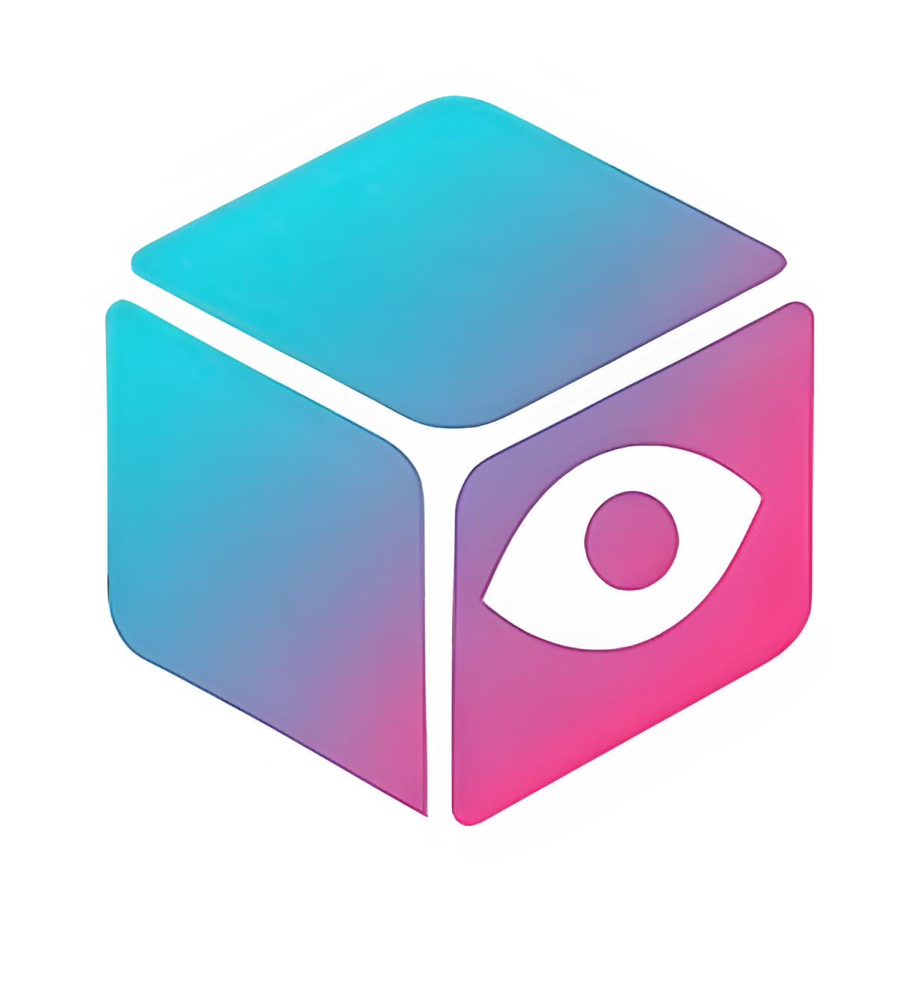
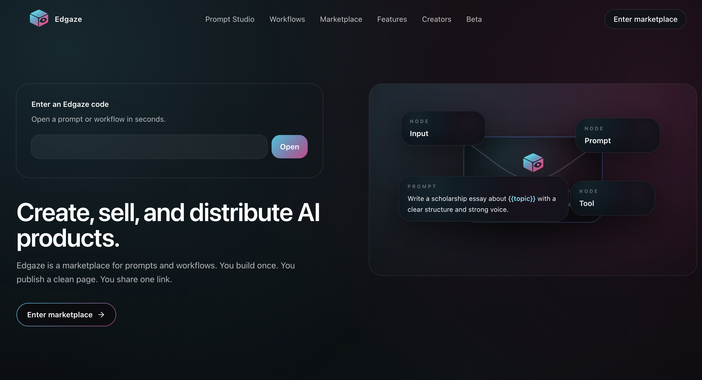
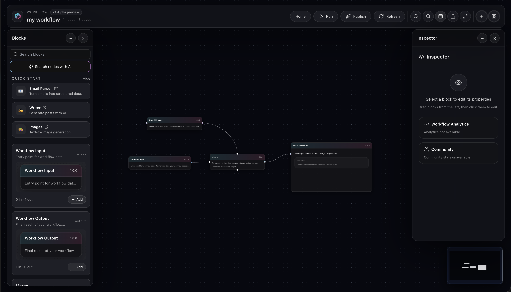

<div align="center">



# **Edgaze**

### *Create, sell, and distribute AI products.*

**A marketplace for prompts and workflows.** Build once. Publish a clean page. Share one link.

<br />

[](https://nextjs.org/)
[](https://www.typescriptlang.org/)
[](https://nodejs.org/)

<br />

[**Product**](#-product) • [**Screenshots**](#-screenshots) • [**Tech**](#-tech) • [**Run locally**](#-run-locally)

</div>

---

## Product

**Edgaze** is a platform where creators build, publish, and distribute AI products—prompts and workflows—through a single marketplace and shareable links.

| Pillar | What it does |
|--------|----------------|
| **Prompt Studio** | Create prompts with structure and placeholders. Version, publish, and share a clean product page. |
| **Workflow Builder** | Build visual flows: inputs, prompts, tools, outputs. One canvas, one link, repeatable runs. |
| **Marketplace** | Discovery, search, and product pages. Creators get a storefront; users open and run in one tap. |

Every prompt and workflow gets a short **Edgaze code** (e.g. `@handle/essay`) and a direct link. The product is in **beta**: creators can set prices; payments will activate later.

---

## Screenshots

<div align="center">

**Landing — Enter a code, open a prompt or workflow**



<br /><br />

**Workflow Builder — Visual canvas, publish and share**



</div>

---

## Tech

- **Framework:** Next.js 16 (App Router)
- **Language:** TypeScript
- **UI:** React 18, Tailwind CSS, Framer Motion
- **Runtime:** Node.js 20+

---

## Run locally

**Prerequisites:** Node.js 20+, npm (or pnpm/yarn).

1. **Clone the repository** and install dependencies:

   ```bash
   npm install
   ```

2. **Environment:** Copy `.env.example` to `.env.local` and set the required variables for your environment.

3. **Start the dev server:**

   ```bash
   npm run dev
   ```

   Open [http://localhost:3000](http://localhost:3000).

---

## Scripts

| Command | Description |
|--------|-------------|
| `npm run dev` | Development server |
| `npm run build` | Production build |
| `npm run start` | Production server |
| `npm run lint` | Lint |
| `npm run typecheck` | Type check |

---

## License

Proprietary. All rights reserved.

---

<div align="center">

**Edgaze** — *Collect → Publish → Share*

</div>
