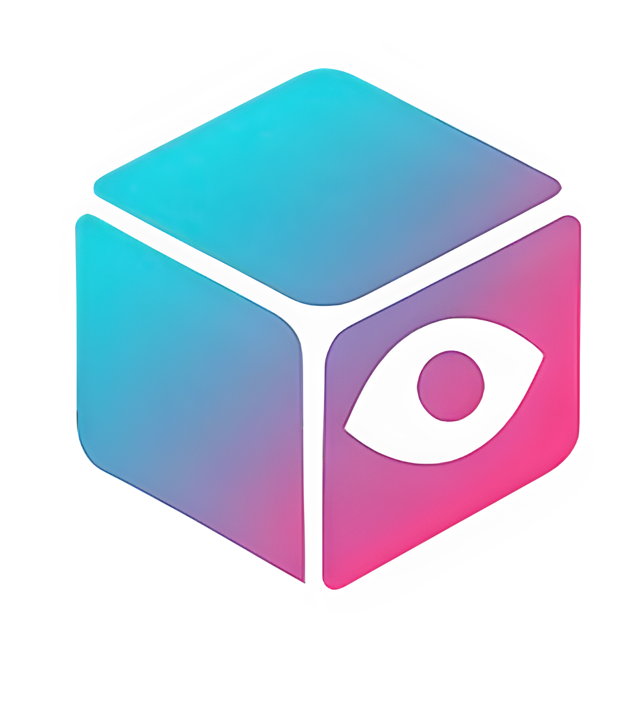
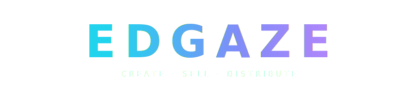
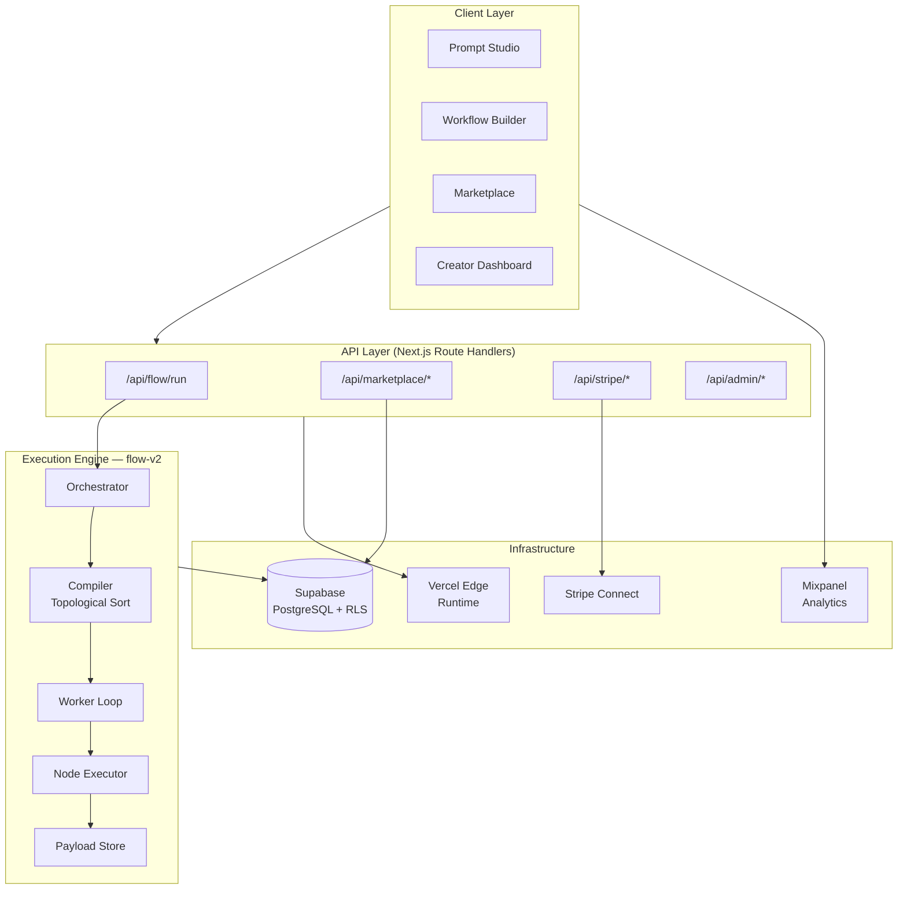

<div align="center">



<br /><br />



<br />

[](https://github.com/edgaze-ai/edgaze/actions/workflows/ci.yml)&nbsp;
[](https://github.com/edgaze-ai/edgaze/releases)&nbsp;
[](https://nextjs.org/)&nbsp;
[](https://react.dev/)&nbsp;
[](https://www.typescriptlang.org/)&nbsp;
[](https://supabase.com/)&nbsp;
[](LICENSE)

<br />

[Overview](#-overview) &ensp;·&ensp; [Product](#-product) &ensp;·&ensp; [Architecture](#-architecture) &ensp;·&ensp; [Tech Stack](#-tech-stack) &ensp;·&ensp; [Project Structure](#-project-structure) &ensp;·&ensp; [Scripts](#-scripts) &ensp;·&ensp; [Environment](#-environment) &ensp;·&ensp; [CI/CD](#-cicd) &ensp;·&ensp; [Setup](#-internal-setup)

</div>

---

## Overview

**Edgaze** is a first-party platform for building, publishing, and distributing AI products at scale. Prompts and workflows get a permanent home — a polished product page, a short **Edgaze code** (e.g. `@handle/essay`), and a single shareable link.

Creators build in the **Prompt Studio** or **Workflow Builder**, set a price, and publish to the **Marketplace**. Buyers discover, run, and purchase — no setup, no API keys, no friction. The platform handles authentication, execution, payments, and analytics end-to-end.

> _No fragmentation. One place to create. One place to discover. One place to run._

<br />

<table>
<tr>
<td width="25%" align="center"><strong>Hosted Execution</strong><br/><sub>Runs happen on-platform. Buyers get results, not configuration.</sub></td>
<td width="25%" align="center"><strong>Creator Economy</strong><br/><sub>Stripe Connect payouts, earnings dashboards, tier-based run quotas.</sub></td>
<td width="25%" align="center"><strong>Canonical Identity</strong><br/><sub>Every asset has a permanent URL and a short Edgaze code.</sub></td>
<td width="25%" align="center"><strong>Curated Quality</strong><br/><sub>Open onboarding with moderation to keep the catalog clean.</sub></td>
</tr>
</table>

---

## Product

### Prompt Studio

A structured editor for crafting AI prompts with named placeholders.

- **Placeholder syntax** — `{{placeholder_name}}` fields become custom input questions for the buyer
- **Version snapshots** — full version history with one-click rollback and publish
- **Product page** — every prompt gets a clean, shareable product page with a canonical Edgaze code
- **Token estimation** — live token count to guide prompt design
- **Monetization** — free, one-time paywall, subscription, or hybrid pricing models

### Workflow Builder

A visual, node-based automation canvas built on React Flow.

- **Live canvas** — drag, connect, and run workflows without leaving the builder
- **Node library** — four categories of nodes, each with typed input/output ports:

  | Category    | Nodes                               |
  | ----------- | ----------------------------------- |
  | **I/O**     | Input, Output                       |
  | **AI**      | LLM Chat, LLM Embeddings, LLM Image |
  | **Logic**   | Merge, Condition, Delay, Loop       |
  | **Utility** | HTTP Request, JSON Parse, Template  |

- **Execution modes** — private test runs in the builder; production runs via the hosted execution engine
- **Versioning** — publish named versions; buyers always run the latest published version
- **Access control** — private, unlisted, and public visibility per workflow
- **Remix controls** — cloning and remixing with per-asset permission settings

### Marketplace

A curated discovery layer for the full catalog of prompts and workflows.

- **Search** — full-text search with live Edgaze code and creator handle suggestions
- **Browse by category** — filtered views by taxonomy (AI Agents, Marketing, Startups, and more)
- **Trending** — algorithmically ranked "trending this week" surface on the homepage
- **Creator storefronts** — dedicated profile pages with stats, products, and founding-creator badges
- **Sort modes** — trending, newest, most popular, most loved
- **Run in one tap** — authenticated buyers run directly from the product page; no setup required

### Creator Dashboard

- **Earnings overview** — lifetime revenue, pending payouts, and transaction history
- **Stripe Connect** — embedded onboarding, express dashboard, and real-time balance tracking
- **Product management** — edit, unpublish, or remove listings from the library view
- **Analytics** — view count, like count, and run count per asset

<div align="center">

</div>

## Architecture


```mermaid
graph TD
    subgraph Client["Client Layer"]
        PS[Prompt Studio]
        WB[Workflow Builder]
        MP[Marketplace]
        CD[Creator Dashboard]
    end

    subgraph API["API Layer (Next.js Route Handlers)"]
        FAPI["/api/flow/run"]
        MAPI["/api/marketplace/*"]
        SAPI["/api/stripe/*"]
        AAPI["/api/admin/*"]
    end

    subgraph Engine["Execution Engine — flow-v2"]
        ORC[Orchestrator]
        COMP[Compiler\nTopological Sort]
        WLOOP[Worker Loop]
        NEXEC[Node Executor]
        PS2[Payload Store]
    end

    subgraph Infra["Infrastructure"]
        SB[(Supabase\nPostgreSQL + RLS)]
        STRIPE[Stripe Connect]
        VERCEL[Vercel Edge\nRuntime]
        MX[Mixpanel\nAnalytics]
    end

    Client --> API
    FAPI --> ORC
    ORC --> COMP
    COMP --> WLOOP
    WLOOP --> NEXEC
    NEXEC --> PS2
    MAPI --> SB
    SAPI --> STRIPE
    Engine --> SB
    API --> VERCEL
    Client --> MX
```

### Execution Engine — `flow-v2`

The production workflow execution engine is an **event-driven, worker-based runtime** with the following pipeline:

| Stage | Component             | Responsibility                                                           |
| ----- | --------------------- | ------------------------------------------------------------------------ |
| 1     | `orchestrator.ts`     | Accepts a run request; initializes run record; marks entry nodes `ready` |
| 2     | `compiler.ts`         | Compiles workflow definition → topological order + dependency map        |
| 3     | `worker-loop.ts`      | Polls claimable nodes; drives state transitions; detects termination     |
| 4     | `node-executor.ts`    | Executes individual nodes by spec; resolves inputs from upstream outputs |
| 5     | `payload-store.ts`    | Stores and retrieves large intermediate payloads                         |
| 6     | `outcome-resolver.ts` | Determines final run outcome from node result set                        |

**Run lifecycle states:** `created` → `queued` → `running` → `completed | failed | cancelled`

**Node lifecycle states:** `pending` → `ready` → `queued` → `running` → `completed | failed | timed_out | blocked | skipped`

<details>
<summary><strong>Legacy engine — <code>flow</code></strong></summary>

The original `src/server/flow/` engine remains in the codebase for backward compatibility and local development mode. It uses a synchronous Kahn's-algorithm topological sort, edge gating, and resource pool management. New features are built exclusively against `flow-v2`.

</details>

---

## Tech Stack

<table>
<thead>
<tr>
<th>Layer</th>
<th>Technology</th>
<th>Version</th>
<th>Purpose</th>
</tr>
</thead>
<tbody>
<tr><td rowspan="6"><strong>Frontend</strong></td>
<td>Next.js (App Router)</td><td>16</td><td>Full-stack React framework, SSR/SSG/ISR, route handlers</td></tr>
<tr><td>React</td><td>19</td><td>UI runtime, concurrent features</td></tr>
<tr><td>TypeScript</td><td>5.6</td><td>Strict type-safety across the full stack</td></tr>
<tr><td>Tailwind CSS</td><td>4.2</td><td>Utility-first styling with PostCSS integration</td></tr>
<tr><td>Framer Motion</td><td>12</td><td>Production-grade animations and transitions</td></tr>
<tr><td>React Flow</td><td>11</td><td>Node-canvas renderer for the Workflow Builder</td></tr>
<tr><td rowspan="4"><strong>Backend</strong></td>
<td>Supabase</td><td>2.84</td><td>Auth, PostgreSQL database, Row Level Security, Storage</td></tr>
<tr><td>Next Auth</td><td>4.24</td><td>OAuth session management (Google, Apple, LinkedIn, Facebook)</td></tr>
<tr><td>Stripe</td><td>20.4</td><td>Checkout sessions, subscriptions, Connect payouts</td></tr>
<tr><td>Stripe Connect.js</td><td>3.3</td><td>Embedded creator merchant onboarding and dashboard</td></tr>
<tr><td rowspan="3"><strong>Infrastructure</strong></td>
<td>Vercel</td><td>—</td><td>Edge deployment, CDN, serverless functions</td></tr>
<tr><td>GitHub Actions</td><td>—</td><td>CI pipeline (format, lint, typecheck, build)</td></tr>
<tr><td>Node.js</td><td>≥ 20</td><td>Runtime requirement</td></tr>
<tr><td rowspan="3"><strong>Observability</strong></td>
<td>Mixpanel</td><td>2.73</td><td>Product analytics and event tracking</td></tr>
<tr><td>Vercel Analytics</td><td>1.6</td><td>Web vitals and page-level performance</td></tr>
<tr><td>Execution Traces</td><td>—</td><td>Per-run node-level trace storage and admin inspection</td></tr>
<tr><td rowspan="4"><strong>Build / DX</strong></td>
<td>Vitest</td><td>3.0</td><td>Unit and integration tests</td></tr>
<tr><td>ESLint + Next plugin</td><td>9.39</td><td>Lint with Core Web Vitals rules</td></tr>
<tr><td>Prettier</td><td>3.3</td><td>Code formatting (100-char width, trailing commas)</td></tr>
<tr><td>sharp</td><td>0.34</td><td>Server-side image processing (OG images, icons)</td></tr>
</tbody>
</table>

---

## Project Structure

```
edgaze-prod/
├── .github/
│   └── workflows/
│       └── ci.yml                  # CI pipeline (format → lint → typecheck → build)
├── public/
│   ├── brand/                      # Logo assets and PWA icons
│   ├── favicon.ico                 # Multi-size favicon
│   ├── favicon-16x16.png
│   ├── favicon-32x32.png
│   ├── apple-touch-icon.png        # 180×180 PWA icon
│   ├── web-app-manifest-192x192.png
│   ├── og.png                      # 1200×630 Open Graph image
│   └── site.webmanifest            # PWA manifest
├── scripts/
│   ├── generate-og.mjs             # Generates public/og.png
│   ├── generate-favicon-ico.mjs    # Generates all favicon/PWA rasters from brand mark
│   └── copy-pdf-worker.mjs         # Postinstall: copies PDF.js worker into public/
├── src/
│   ├── app/                        # Next.js App Router
│   │   ├── [ownerHandle]/[edgazeCode]/  # Public product pages
│   │   ├── admin/                  # Admin panel (moderation, runs, traces, invites)
│   │   ├── api/                    # 40+ route handlers
│   │   │   ├── flow/               # Workflow execution endpoints
│   │   │   ├── marketplace/        # Publish, search, like
│   │   │   ├── stripe/             # Checkout, Connect, webhooks
│   │   │   ├── admin/              # Admin-only operations
│   │   │   ├── cron/               # Background jobs
│   │   │   └── og/                 # Dynamic OG image generation
│   │   ├── auth/                   # OAuth callback, confirm, reset, sign-in-to-buy
│   │   ├── builder/                # Workflow Builder UI
│   │   ├── checkout/               # Stripe Checkout flow
│   │   ├── dashboard/earnings/     # Creator earnings and Stripe Connect
│   │   ├── docs/                   # In-app documentation (MDX)
│   │   ├── library/                # User's created and purchased items
│   │   ├── marketplace/            # Marketplace browse + category pages
│   │   ├── prompt-studio/          # Prompt Studio UI
│   │   ├── profile/                # Public creator profiles
│   │   ├── settings/               # User account settings
│   │   └── layout.tsx              # Root layout, metadata, fonts
│   ├── components/
│   │   ├── builder/                # Builder toolbar, canvas, inspector, node library
│   │   ├── marketplace/            # Search, listing cards, storefront
│   │   ├── prompt-studio/          # Prompt editor, placeholder UI, run modal
│   │   ├── auth/                   # Auth gate components
│   │   ├── layout/                 # Nav, sidebar, shell components
│   │   └── ui/                     # Reusable design system primitives
│   ├── nodes/
│   │   ├── NODE_REGISTRY.ts        # Node metadata (label, category, color, icon)
│   │   ├── registry.ts             # Port specs and handler bindings
│   │   ├── premium.ts              # Restricted node handlers
│   │   └── types.ts                # Node type definitions
│   ├── server/
│   │   ├── flow/                   # Legacy execution engine (dev/compat)
│   │   └── flow-v2/                # Production execution engine
│   │       ├── orchestrator.ts     # Run initialization
│   │       ├── compiler.ts         # Workflow → topological compiled form
│   │       ├── worker-loop.ts      # Main execution loop
│   │       ├── node-executor.ts    # Per-node execution
│   │       ├── node-worker.ts      # Worker process
│   │       ├── outcome-resolver.ts # Final run outcome
│   │       └── payload-store.ts    # Intermediate payload storage
│   ├── lib/
│   │   ├── supabase/               # Client, server, and admin Supabase instances
│   │   ├── stripe/                 # Stripe SDK configuration
│   │   ├── workflow/               # Workflow utilities
│   │   ├── markdown/               # Markdown normalization
│   │   └── og/                     # OG card components (satori)
│   └── types/
│       └── supabase.ts             # Generated database types (do not edit manually)
├── eslint.config.js                # ESLint flat config (Next.js Core Web Vitals)
├── prettier.config.cjs             # Prettier config
├── tsconfig.json                   # TypeScript config (strict, noUncheckedIndexedAccess)
├── next.config.mjs                 # Next.js config (webpack, transpilePackages, headers)
├── vitest.config.ts                # Test runner config
└── package.json
```

---

## Scripts

| Command                    | Description                                                      |
| -------------------------- | ---------------------------------------------------------------- |
| `npm run dev`              | Start development server (`localhost:3000`)                      |
| `npm run build`            | Production build (`next build --webpack`)                        |
| `npm run start`            | Start production server (requires prior build)                   |
| `npm run lint`             | ESLint with Next.js Core Web Vitals ruleset                      |
| `npm run lint:fix`         | ESLint with auto-fix                                             |
| `npm run typecheck`        | TypeScript type-check without emit (`tsc --noEmit`)              |
| `npm run format`           | Prettier write across all source files                           |
| `npm run format:check`     | Prettier check (used in CI)                                      |
| `npm run test`             | Vitest single-run                                                |
| `npm run test:watch`       | Vitest interactive watch mode                                    |
| `npm run og:generate`      | Regenerate `public/og.png` (1200×630 Open Graph image)           |
| `npm run favicon:generate` | Regenerate all favicon and PWA icon rasters from brand mark      |
| `npm run db:types`         | Regenerate `src/types/supabase.ts` from the live Supabase schema |
| `npm run db:push`          | Push pending database migrations                                 |
| `npm run db:reset`         | Reset the local development database                             |
| `npm run clean`            | Remove `.next` and `node_modules`                                |
| `npm run reinstall`        | Clean and reinstall all dependencies                             |

---

## Environment

Copy `.env.example` to `.env.local` and configure the following variables:

<details>
<summary><strong>Required — Application</strong></summary>

```env
NEXT_PUBLIC_APP_URL=http://localhost:3000
```

</details>

<details>
<summary><strong>Required — Supabase</strong></summary>

```env
NEXT_PUBLIC_SUPABASE_URL=
NEXT_PUBLIC_SUPABASE_ANON_KEY=
SUPABASE_SERVICE_ROLE_KEY=
SUPABASE_JWT_SECRET=
NEXT_PUBLIC_SUPABASE_PROJECT_ID=
```

</details>

<details>
<summary><strong>Required — Authentication</strong></summary>

```env
NEXTAUTH_URL=http://localhost:3000
NEXTAUTH_SECRET=
```

</details>

<details>
<summary><strong>Required — Stripe</strong></summary>

```env
NEXT_PUBLIC_STRIPE_PUBLISHABLE_KEY=
STRIPE_SECRET_KEY=
STRIPE_WEBHOOK_SECRET=
```

</details>

<details>
<summary><strong>Optional — OAuth Providers</strong></summary>

```env
GOOGLE_CLIENT_ID=
GOOGLE_CLIENT_SECRET=
NEXT_PUBLIC_GOOGLE_GSI_CLIENT_ID=
```

</details>

<details>
<summary><strong>Optional — Turnstile (bot protection)</strong></summary>

```env
NEXT_PUBLIC_TURNSTILE_SITE_KEY=
TURNSTILE_SECRET_KEY=
```

</details>

<details>
<summary><strong>Optional — AI keys (platform-funded runs)</strong></summary>

```env
EDGAZE_OPENAI_API_KEY=
EDGAZE_ANTHROPIC_API_KEY=
EDGAZE_GEMINI_API_KEY=
```

</details>

---

## CI/CD

Every push and pull request to `main` or `develop` runs the full quality pipeline via GitHub Actions.

```
📥 Checkout
   ↓
🖼  Verify static assets (og.png, favicon.ico, favicon-16×16, favicon-32×32)
   ↓
🔧 Node.js 20 setup + npm ci
   ↓
🎨 Prettier format check
   ↓
🔍 ESLint (Next.js Core Web Vitals)
   ↓
🏷  TypeScript — tsc --noEmit (strict mode)
   ↓
🧹 Clean .next
   ↓
🏗  next build --webpack (142 routes, full production build)
   ↓
✅ All checks passed
```

- **Concurrency** — superseded PR runs are cancelled automatically; pushes to `main` and `develop` always complete.
- **Secrets** — Supabase and Stripe credentials fall back to safe placeholder values for fork PRs so the build still completes without production access.
- **Timeout** — hard 15-minute cap on the quality job.

---

## Internal Setup

> **Access to this repository is restricted to authorized personnel of Edge Platforms, Inc.**
> The steps below are intended for internal engineering team members with the necessary credentials.

### Prerequisites

| Requirement                      | Version                 |
| -------------------------------- | ----------------------- |
| Node.js                          | ≥ 20                    |
| npm                              | ≥ 9 (bundled with Node) |
| Supabase CLI                     | Latest                  |
| Access to internal secrets store | Required                |

### First-time setup

```bash
# 1. Install dependencies
npm ci

# 2. Configure environment
cp .env.example .env.local
# Fill in values from the internal secrets store

# 3. Push database schema
npm run db:push

# 4. Regenerate types if schema changed
npm run db:types

# 5. Start the development server
npm run dev
```

### Regenerating assets

```bash
# Regenerate OG image after updating brand copy
npm run og:generate

# Regenerate favicons and PWA icons after updating public/brand/edgaze-mark.png
npm run favicon:generate
```

### Running the test suite

```bash
# Single run (matches CI)
npm run test

# Watch mode for TDD
npm run test:watch
```

---

## Platform Status

| Signal           | Status                     |
| ---------------- | -------------------------- |
| Production build | ✅ Passing                 |
| CI pipeline      | ✅ All checks green        |
| Test suite       | ✅ 33 tests, 8 suites      |
| Version          | 1.2.2 — production release |
| Access           | Open to everyone           |
| Source           | Closed — proprietary       |

---

<div align="center">

---

**Proprietary Software — All Rights Reserved**

This repository and all of its contents are the exclusive intellectual property of **Edge Platforms, Inc.**, a Delaware Corporation.

Unauthorized access, copying, modification, distribution, sublicensing, or use of this software — in whole or in part — is strictly prohibited and may constitute a violation of applicable law.

No license, express or implied, is granted to any party outside of Edge Platforms, Inc. and its authorized contractors.

See [`LICENSE`](LICENSE) for the full terms.

<br />

<sub>Built with Next.js · TypeScript · Supabase · Stripe</sub>

<br />


</div>
