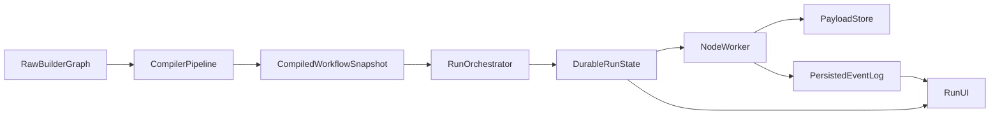

# Workflow Runner Premium Cutover Plan

This document is the correctness-first implementation contract for the workflow runner. The system must become correct before it becomes merely durable.

## Goal

The end-state is:

- compile raw builder graph into an immutable executable snapshot
- enforce strict named input and output ports on every node
- bind every edge from one explicit source output port to one explicit target input port
- materialize node inputs deterministically from compiled bindings only
- persist structured outputs by output port
- execute outside request ownership with lease and recovery support
- stream only persisted events
- render the UI from compiled snapshot + durable run state + persisted events
- eliminate implicit arrays, insertion-order behavior, and handler guessing



## Core Principles

- No runtime execution from raw graph JSON.
- No implicit merge or magic fan-in behavior.
- No reliance on edge insertion order, inbound arrays, or `Object.entries()` ordering.
- No handler-level guessing about which value belongs to which port.
- A node runs only after its full materialized input packet is built and persisted.
- Output is always structured by named output port.
- UI truth comes from persisted port-level data, not client reconstruction.

## Current Problems To Eliminate

- The compiler still allows too much implicit behavior around port shape and bindings.
- Materialization currently assumes one value per target port and overwrites rather than modeling multiplicity.
- Execution still contains legacy array-based adapter semantics through `getInboundValues()`.
- The viewer still reconstructs node input from raw graph edges instead of durable port-level truth.
- The premium path still contains transitional compatibility glue in `src/app/api/flow/run/route.ts`.
- Durable state exists, but execution ownership is still too tied to request lifetime.
- Claimed running attempts can get stranded because there is no lease or reclaim model.
- Retry scheduling is not yet a real deterministic policy engine.
- Anonymous/demo runs do not yet have a clean durable access story.

## A. Canonical Runtime Types

These are the target runtime shapes the repo should converge toward.

```ts
export type PortValueType =
  | "any"
  | "string"
  | "number"
  | "boolean"
  | "json"
  | "array"
  | "object"
  | "binary";

export type PortMultiplicity = "single" | "multi_list" | "multi_object";

export interface PortSpec {
  id: string;
  label: string;
  kind: "input" | "output";
  valueType: PortValueType;
  multiplicity: PortMultiplicity;
  required: boolean;
  description?: string;
  objectKeyFrom?: "source_node_id" | "source_port_id" | "edge_label";
}

export interface CompiledInputBinding {
  edgeId: string;
  targetNodeId: string;
  targetPortId: string;
  sourceNodeId: string;
  sourcePortId: string;
  sourceValueType: PortValueType;
  targetValueType: PortValueType;
  multiplicity: PortMultiplicity;
  objectEntryKey?: string;
  bindingOrderKey: string;
}

export interface CompiledNode {
  id: string;
  specId: string;
  title?: string;
  topoIndex: number;
  config: Record<string, SerializableValue>;
  inputPorts: PortSpec[];
  outputPorts: PortSpec[];
  inputBindings: CompiledInputBinding[];
  dependencyNodeIds: string[];
  downstreamNodeIds: string[];
  isEntryNode: boolean;
  isTerminalNode: boolean;
  failurePolicy: FailurePolicy;
}

export interface CompiledEdge {
  id: string;
  sourceNodeId: string;
  sourcePortId: string;
  targetNodeId: string;
  targetPortId: string;
  bindingOrderKey: string;
}

export interface MaterializedInputSourceValue {
  edgeId: string;
  sourceNodeId: string | "__run_input__" | "__node_config__";
  sourcePortId: string;
  targetPortId: string;
  objectEntryKey?: string;
  value: SerializableValue;
}

export interface MaterializedNodeInputPort {
  targetPortId: string;
  multiplicity: PortMultiplicity;
  valueType: PortValueType;
  value: SerializableValue;
  sources: MaterializedInputSourceValue[];
}

export interface MaterializedNodeInput {
  runId: string;
  nodeId: string;
  specId: string;
  attemptNumber: number;
  config: Record<string, SerializableValue>;
  ports: Record<string, MaterializedNodeInputPort>;
}

export interface NodeExecutionResult {
  status: "completed" | "failed" | "timed_out" | "cancelled";
  outputsByPort?: Record<string, SerializableValue>;
  error?: {
    message: string;
    code?: string;
    details?: SerializableValue;
    retryable: boolean;
  };
  logs?: Array<{
    timestamp: string;
    level: "debug" | "info" | "warn" | "error";
    message: string;
  }>;
  metrics?: {
    startedAt: string;
    endedAt: string;
    durationMs: number;
  };
}
```

## B. Compiler Design

### Compiler responsibilities

Files:

- `src/server/flow-v2/compiler.ts`
- new: `src/server/flow-v2/graph-normalizer.ts`
- new: `src/server/flow-v2/port-validator.ts`
- `src/server/flow-v2/specs.ts`

The compiler must:

- normalize the builder graph into canonical node and edge records
- validate node config schema before execution
- require every node spec to declare explicit named input ports and output ports
- require every edge to resolve exactly one `sourcePortId -> targetPortId` mapping
- validate source and target port compatibility
- validate multiplicity rules:
  - `single` accepts at most one source
  - `multi_list` accepts many sources and preserves deterministic ordered list semantics
  - `multi_object` accepts many sources only if each source maps to a unique stable object key
- reject ambiguous or invalid mappings
- compute deterministic topo order with stable tie-breaking
- generate sorted explicit bindings with stable `bindingOrderKey`
- freeze the immutable compiled snapshot

### Strict validation rules

Reject compile if:

- a node does not declare ports
- an edge references a missing source or target node
- an edge references a missing source or target port
- an edge omits port ids where the node exposes multiple candidate ports
- a `single` input port has multiple inbound bindings
- a `multi_object` port has object key collisions
- source output type cannot feed target input type
- a required input port is unsatisfied
- a graph path requires runtime inference to resolve binding behavior
- a workflow contains cycles
- a terminal path is unreachable if the product treats that as invalid

### Determinism rules

The compiler must never rely on:

- builder edge insertion order
- DB row order
- JavaScript object key order
- runtime handler ordering

Use:

- stable node sorting by node id before graph algorithms
- stable edge sorting by canonical edge key
- stable topo ordering with deterministic tie-breaking
- stable binding sorting by `bindingOrderKey`

## C. Execution Design

### Input materialization

Files:

- `src/server/flow-v2/materializer.ts`
- new: `src/server/flow-v2/port-materializer.ts`
- `src/server/flow-v2/node-worker.ts`
- `src/server/flow-v2/node-executor.ts`

Rules:

- a node executes only after all required target ports are satisfied
- materialization uses compiled bindings only
- source values come only from:
  - run input
  - node config fallback
  - upstream `outputsByPort[sourcePortId]`
- each target input port is materialized according to its declared multiplicity:
  - `single` -> one exact value
  - `multi_list` -> deterministic ordered array
  - `multi_object` -> deterministic keyed object
- the exact `MaterializedNodeInput` packet is persisted before execution starts

### Output persistence

Persist outputs by port, not as one ambiguous node blob.

Target output payload shape:

```ts
{
  ports: {
    summary: "...",
    raw: {...},
    image: "https://..."
  }
}
```

Downstream materialization must read the exact bound output port:

- source node `A`
- source output port `summary`
- target input port `prompt`

### Downstream reevaluation

Files:

- `src/server/flow-v2/worker-loop.ts`
- `src/server/flow-v2/orchestrator.ts`

Rules:

- downstream readiness must be evaluated from compiled dependency and port satisfaction only
- no vague “some upstream succeeded so this might run” logic
- a node becomes `ready` only when all required target input ports are satisfied
- if a required source can no longer be satisfied because of terminal upstream failure, transition according to explicit failure policy

### Terminal write guard

Mandatory behavior:

- if an attempt finishes after the node is already terminal, ignore the write
- if an attempt finishes after timeout or cancellation finalized the node, ignore the write
- never let a slow external response overwrite a newer terminal state

This guard belongs in:

- `src/server/flow-v2/repository.ts`
- `src/server/flow-v2/node-worker.ts`
- `src/server/flow-v2/worker-loop.ts`

## D. UI And Read-Model Design

Files:

- `src/server/flow-v2/read-model.ts`
- new: `src/server/flow-v2/read-model-ports.ts`
- `src/components/builder/PremiumWorkflowRunModal.tsx`
- new: `src/lib/workflow/run-session.ts`

The UI must show:

- node input ports and output ports exactly as declared in compiled snapshot
- exact `sourcePort -> targetPort` mappings
- exact materialized input packet by input port
- exact output payload by output port
- downstream satisfaction state:
  - satisfied
  - waiting on specific port
  - blocked because specific source never materialized
  - skipped due to policy

Premium UX rules:

- order nodes by compiled `topoIndex`, never raw graph heuristics
- show explicit port pills such as `input.prompt`, `output.summary`
- show exact source node and source port for every materialized input contribution
- never reconstruct node input by scanning raw edges in the component
- never show guessed “next step” behavior

## E. Concrete Repo Implementation Plan

### Files to create

- `src/server/flow-v2/graph-normalizer.ts`
- `src/server/flow-v2/port-validator.ts`
- `src/server/flow-v2/port-materializer.ts`
- `src/server/flow-v2/outcome-resolver.ts`
- `src/server/flow-v2/read-model-ports.ts`
- `src/lib/workflow/run-session.ts`

Optional UI split if desired:

- `src/components/builder/run-view/PortBindingList.tsx`
- `src/components/builder/run-view/MaterializedInputPanel.tsx`
- `src/components/builder/run-view/OutputPortsPanel.tsx`

### Files to modify

- `src/server/flow-v2/types.ts`
- `src/server/flow-v2/specs.ts`
- `src/server/flow-v2/compiler.ts`
- `src/server/flow-v2/materializer.ts`
- `src/server/flow-v2/node-executor.ts`
- `src/server/flow-v2/node-worker.ts`
- `src/server/flow-v2/repository.ts`
- `src/server/flow-v2/worker-loop.ts`
- `src/server/flow-v2/orchestrator.ts`
- `src/server/flow-v2/read-model.ts`
- `src/app/api/flow/run/route.ts`
- `src/components/builder/PremiumWorkflowRunModal.tsx`
- `src/app/builder/BuilderClientPage.tsx`
- `src/app/[ownerHandle]/[edgazeCode]/page.tsx`
- `src/app/p/[ownerHandle]/[edgazeCode]/page.tsx`

### Legacy mapping logic to delete

Delete from execution path:

- `src/server/flow-v2/materializer.ts`
  - the current single-value overwrite behavior:
  - `portValues[targetPortId] = sourceValue.value`
- `src/server/flow-v2/node-executor.ts`
  - legacy `getInboundValues()` array semantics
- any runtime logic that depends on positional inbound ordering rather than named target ports

Delete from UI path:

- `src/components/builder/PremiumWorkflowRunModal.tsx`
  - `getDeterministicNodeOrder()` when used as run-truth reconstruction from raw graph
  - `getNodeResolvedInput()` that walks raw edges and invents an object keyed by node title
- `src/app/builder/BuilderClientPage.tsx`
  - `getExecutionOrder()` for live run truth
  - legacy `complete.result` mapping glue once read-model cutover is complete
- equivalent raw-graph reconstruction in marketplace pages

Delete conceptually:

- implicit merge behavior
- inbound array assumptions
- handler guessing about which upstream value belongs to which input port
- single ambiguous node output blob for multi-output nodes

## Correctness-First Workstreams

### 0. Compiler Workstream

Make the compiler the first and most important workstream.

Files:

- `src/server/flow-v2/compiler.ts`
- new: `src/server/flow-v2/graph-normalizer.ts`
- new: `src/server/flow-v2/port-validator.ts`
- `src/server/flow-v2/specs.ts`

Deliverables:

- canonical normalization
- strict port and config validation
- explicit deterministic bindings
- path validation
- immutable compiled snapshot

### 1. Durable Run Schema Workstream

Files:

- `supabase/migrations/20260327000000_workflow_execution_v2.sql`
- `supabase/migrations/20260327000001_workflow_execution_v2_claims.sql`
- `src/server/flow-v2/repository.ts`

Deliverables:

- run idempotency key
- attempt lease fields
- worker-bound persistence guards
- compiled snapshot hash frozen on run

### 2. Orchestrator Contract Workstream

Files:

- `src/server/flow-v2/orchestrator.ts`
- `src/server/flow-v2/worker-loop.ts`
- new: `src/server/flow-v2/outcome-resolver.ts`

Deliverables:

- deterministic node readiness
- strict dependency resolution
- centralized workflow outcome logic
- no DB natural ordering assumptions

### 3. Input Materialization Workstream

Files:

- `src/server/flow-v2/materializer.ts`
- new: `src/server/flow-v2/port-materializer.ts`
- `src/server/flow-v2/node-worker.ts`
- `src/server/flow-v2/node-executor.ts`

Deliverables:

- exact per-port materialized input packet
- deterministic multi-source list and object handling
- no implicit arrays or handler guessing

### 4. Worker Reliability Workstream

Files:

- `src/server/flow-v2/worker-runner.ts`
- `src/server/flow-v2/worker-loop.ts`
- new: `src/server/flow-v2/worker-service.ts`

Deliverables:

- separate execution ownership from request lifetime
- lease and reclaim
- terminal write guard
- timeout and cancellation corruption protection

### 5. Retry Engine Workstream

Files:

- `src/server/flow-v2/node-executor.ts`
- `src/server/flow-v2/node-worker.ts`
- `src/server/flow-v2/worker-loop.ts`

Deliverables:

- deterministic retry backoff
- retryable error classification
- durable attempt-level retry scheduling

### 6. Attempt-Level Event Model Workstream

Files:

- `src/server/flow-v2/types.ts`
- `src/server/flow-v2/repository.ts`
- `src/server/flow-v2/orchestrator.ts`
- `src/server/flow-v2/worker-loop.ts`
- `supabase/migrations/20260327000002_workflow_execution_v2_events.sql`

Required events:

- `run.created`
- `run.cancel_requested`
- `node.ready`
- `node.queued`
- `node_materialized_input`
- `node_attempt_started`
- `node_attempt_failed`
- `node_attempt_retried`
- `node_attempt_succeeded`
- `node_finalized`
- `run.completed`

### 7. Payload Durability Workstream

Files:

- `src/server/flow-v2/payload-store.ts`
- `src/server/flow-v2/repository.ts`

Deliverables:

- small payloads inline
- large payloads offloaded to `workflow_run_payload_blobs`

### 8. Read-Model And UI Cutover Workstream

Files:

- new: `src/lib/workflow/run-session.ts`
- `src/app/builder/BuilderClientPage.tsx`
- `src/app/[ownerHandle]/[edgazeCode]/page.tsx`
- `src/app/p/[ownerHandle]/[edgazeCode]/page.tsx`
- `src/components/builder/PremiumWorkflowRunModal.tsx`
- `src/app/api/runs/[runId]/route.ts`
- `src/app/api/runs/[runId]/stream/route.ts`
- `src/app/api/runs/[runId]/events/route.ts`

Deliverables:

- all surfaces use `runId + bootstrap + SSE/polling`
- UI renders exact port-level flow and exact materialized inputs
- UI renders exact outputs by output port
- reconnect and resume become first-class behavior

### 9. Demo And Anonymous Access Workstream

Files:

- `src/app/api/flow/run/route.ts`
- `src/server/flow-v2/read-model.ts`
- marketplace/demo clients

Deliverables:

- either first-class durable demo runs with scoped access
- or explicit isolation of demo fallback from premium runner path

## Recommended Implementation Order

1. Compiler
2. Run, node, attempt schema and idempotency
3. Orchestrator contract
4. Input materialization contract
5. Worker separation and leases
6. Terminal write guard and durable cancellation
7. Retry engine
8. Attempt-level events and SSE/read-model completion
9. UI cutover
10. Demo access model
11. Transitional cleanup

## Highest-Risk Areas

- compiler ambiguity causing durable wrongness
- non-deterministic binding or scheduling order
- stale writes after timeout or cancellation
- incomplete event coverage producing wrong UI truth
- duplicate runs without idempotency protection
- anonymous/demo access drifting from premium runner model

## Recommended Next Slice

The next implementation pass should start with correctness core only:

1. harden compiler and extract explicit validation modules
2. add idempotency key support
3. formalize orchestrator dependency rules
4. harden materialization contract
5. add terminal write guard tests before expanding worker ownership

That produces a trustworthy execution engine first, then a durable and premium one on top of it.
